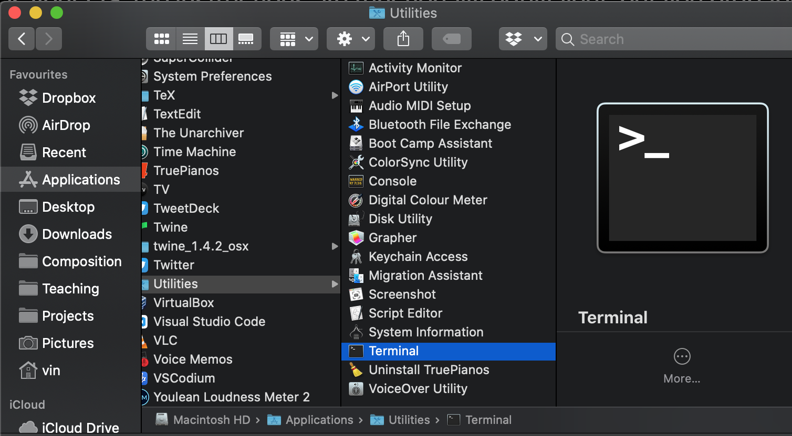
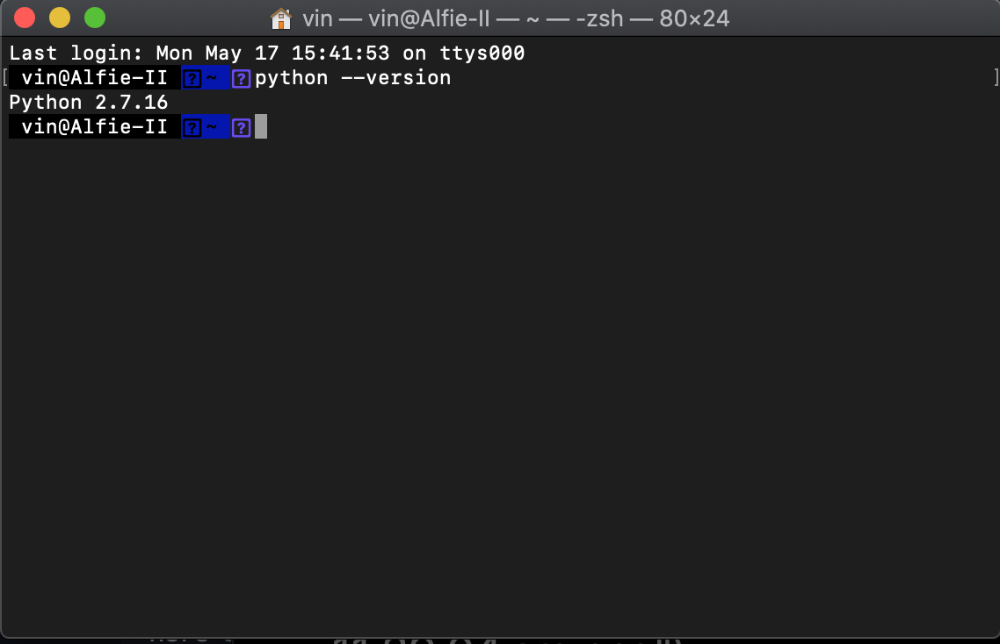
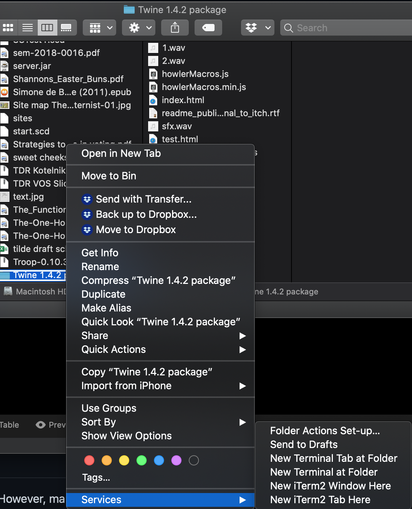

# Running a Python test server on macOS
## macOS 10.10 - 10.15
**ymmv for macOS 11**
_Document version 0.1_
**_Vincent Giles_**

### Introduction
macOS comes with the Python programming language pre-installed. The version is generally python2, and the more recent python3 will need to be installed separately, but for the purposes of testing Twine games, p2 is perfectly fine. You will need the macOS terminal app, or some other command-line app such as iTerm. For this walkthrough, I will use the default terminal, but be aware that it may look a little bit different. If you happen to run Linux or Unix as your OS, the instructions are functionally equivalent, but you probably already know how to do this. :)

### Step 1: confirm that Python is installed and functional

In this screenshot you will see the location of the default macOS terminal application. Applications -> Utilities -> Terminal.app. You should open this.

The next part is to type `python --version` into the terminal and press return. You should see something like the next screenshot (with some minor differences in display).

All going according to play, you should have version 2.x.x installed. If it shows version 3.x.x then that is fine too, but I will include a slightly different command for testing.

You can close the terminal.

### Step 2: Run a test server

The above screenshot shows the right-click context menu that you use to open a folder from the Finder app in the Terminal app. 
Right-click on the folder -> Services -> Open Terminal at Folder. 

This will open the Terminal again but this time your Twine directory will be the operating directory. From here, type `python -m SimpleHTTPServer` and press return. 
This will return something like: `Serving HTTP on 0.0.0.0 port 8000 ...`
It is important that you leave the terminal open while serving. 

### Step 3: Test your Twine

All going to plan, if you have your Twine index.html in the same folder, you can now open a web browser and type `localhost:8000` into the URL bar, and press enter. You should see your twine.

### Step 4: To stop serving

Once you are done testing, go back to the terminal and press `control+c` (not CMD) to end the web server. You may see a heap of GET requests and other things, those are nothing to worry about. You can quit the terminal once it has stopped the server running. Note: do NOT leave the server running as it poses a very minor risk to your system security. 

### For Python 3

If by chance you have Python3 installed, or install it yourself, the instructions are the same except the server command is `python3 -m http.server` or `python -m http.server`, see which works for you. 